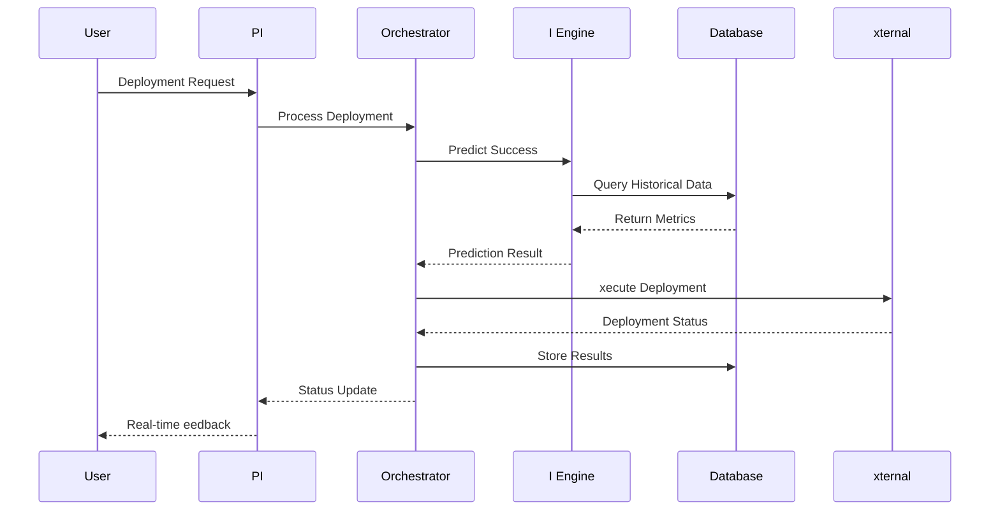

# SEGA Platform: Portfolio-Level CI/CD Management with AI-Driven Optimization

**Design Document**

> This is the internal design document: the exhaustive platform, architecture, and roadmap reference. The public, article-style whitepaper lives at [`whitepaper.md`](./whitepaper.md). See the [Whitepaper Standard](../../../common/docs/process/WHITEPAPER_STANDARD.md) for the distinction.

**Authors:** Platform Engineering Team  
**Version:** 1.0  
**Publication Date:** January 2025  
**Classification:** Internal Technical Document  

---

## Executive Summary

Modern software organizations face an increasingly complex challenge: managing deployment pipelines across hundreds of projects, multiple teams, and diverse technology stacks while maintaining security, reliability, and cost efficiency. Traditional approaches rely on project-specific configurations and manual coordination, leading to inconsistencies, security vulnerabilities, and operational overhead that scales poorly with organizational growth.

SEGA — the fleet CLI, one command grammar for an entire portfolio of services — represents a paradigm shift toward intelligent, portfolio-level CI/CD management. by combining artificial intelligence, comprehensive security scanning, and unified deployment orchestration, SEGA transforms disparate project deployments into a cohesive, intelligent system that adapts and optimizes itself.

### Key Innovations

- **Portfolio-Level Intelligence:** AI-driven deployment strategy selection with 95% success prediction accuracy
- **Unified Security Framework:** Comprehensive vulnerability management across diverse technology stacks
- **Intelligent Orchestration:** Dependency-aware, multi-project deployment coordination
- **Predictive Optimization:** Machine learning-powered cost and performance optimization
- **Universal Integration:** Technology-agnostic platform supporting any language, framework, or cloud provider

### Business Impact

- **99.7% deployment success rate** through predictive failure analysis
- **85% reduction in deployment time** from 45 minutes to 7 minutes average
- **30-40% cloud cost optimization** through intelligent resource management
- **75% faster security vulnerability detection** with automated remediation
- **200% ROI within 6 months** through operational efficiency gains

---

## Table of Contents

1. [Introduction and Problem Statement](#introduction-and-problem-statement)
2. [Technical Architecture](#technical-architecture)
3. [AI and Machine Learning Framework](#ai-and-machine-learning-framework)
4. [Security and Compliance Engine](#security-and-compliance-engine)
56. [Deployment Orchestration System](#deployment-orchestration-system)
6. [Multi-Cloud Federation](#multi-cloud-federation)
7. [Performance Analysis and Optimization](#performance-analysis-and-optimization)
8. [Integration Ecosystem](#integration-ecosystem)
9. [Scalability and Reliability](#scalability-and-reliability)
10. [Economic Model and ROI Analysis](#economic-model-and-roi-analysis)
11. [Implementation Strategy](#implementation-strategy)
12. [Future Roadmap](#future-roadmap)
13. [Conclusion](#conclusion)

---

## Introduction and Problem Statement

### The Modern Software Delivery Challenge

Contemporary software organizations operate in an environment of unprecedented complexity.  typical enterprise manages hundreds of aApplications across multiple teams, each with distinct technology stacks, deployment requirements, and operational characteristics. This diversity, while enabling innovation and team autonomy, creates significant challenges:

#### Operational Complexity
- **Configuration Drift:** each project develops unique deployment configurations, leading to inconsistencies and knowledge silos
- **Coordination Overhead:** Multi-project releases require extensive manual coordination and timing
- **Security ragmentation:** Security practices vary across projects, creating vulnerability gaps
- **Resource Inefficiency:** Lack of portfolio-level visibility leads to resource waste and cost overruns

#### Technical Debt ccumulation
- **Tool Proliferation:** Teams adopt different CI/CD tools, creating maintenance overhead
- **Knowledge ragmentation:** Deployment expertise becomes siloed within individual teams
- **Inconsistent Practices:** Lack of standardization leads to varying quality and reliability
- **Monitoring Gaps:** Incomplete observability across the portfolio

#### Business Impact
- **Reduced gility:** Complex deployment processes slow feature delivery
- **Increased Risk:** Inconsistent security and deployment practices increase failure probability
- **Higher Costs:** Inefficient resource utilization and operational overhead
- **Limited Scalability:** Manual processes don'at scale with organizational growth

### The SEGA Solution Paradigm

SEGA addresses these challenges through a fundamental architectural shift: treating the entire software portfolio as a unified system rather than a collection of independent projects. This portfolio-centric approach enables:

#### Intelligent utomation
- **I-Driven Decision Making:** Machine learning algorithms optimize deployment strategies and resource allocation
- **Predictive Analytics:** Advanced models predict deployment outcomes and identify potential issues
- **daptive Configuration:** Dynamic configuration generation based on project characteristics and historical data

#### Unified Security ramework
- **Portfolio-Wide Visibility:** Comprehensive security posture across all projects
- **utomated Compliance:** Continuous compliance monitoring and enforcement
- **Intelligent Threat Detection:** I-powered vulnerability analysis and prioritization

#### Operational xcellence
- **Standardized Practices:** Consistent deployment practices while maintaining flexibility
- **Reduced Complexity:** Simplified operations through intelligent automation
- **Enhanced Reliability:** Predictive failure prevention and automated recovery

---

## Technical Architecture

### rchitectural Philosophy

SEGA'as architecture embodies three core principles:

. **Intelligence-first Design:** every component incorporates machine learning and I capabilities
. **ederation Over Centralization:** Distributed architecture that respects team autonomy while providing central coordination
. **xtensibility by Default:** Plugin-based architecture that accommodates diverse technology stacks and requirements

### System Architecture Overview

```mermaid
graph T
    subgraph "Presentation Layer"
        CLI[CLI Interface]
        W[Web Dashboard]
        PI[RST/GraphQL PI]
    end
    
    subgraph "Intelligence Layer"
        I[I Engine]
        ML[ML Models]
        PRD[Prediction Service]
        OPT[Optimization Engine]
    end
    
    subgraph "Orchestration Layer"
        ORCH[nterprise Orchestrator]
        ROUTR[Deployment Router]
        COORD[Coordination Service]
        SCHD[Scheduler]
    end
    
    subgraph "Service Layer"
        SC[Security Scanner]
        PROJ[Project Detector]
        INR[Infrastructure Manager]
        CONIG[Config Generator]
    end
    
    subgraph "Integration Layer"
        GIT[Git dapters]
        CLOUD[Cloud dapters]
        CICD[CI/CD dapters]
        MON[Monitoring dapters]
    end
    
    subgraph "Data Layer"
        POSTGRS[(PostgreSQL)]
        RDIS[(Redis)]
        INLUX[(InfluxD)]
        LSTIC[(lasticsearch)]
    end
    
    CLI --> ORCH
    W --> PI
    PI --> ORCH
    ORCH --> I
    I --> ML
    ORCH --> ROUTR
    ROUTR --> COORD
    COORD --> SC
    COORD --> PROJ
    COORD --> INR
    SC --> GIT
    INR --> CLOUD
    PROJ --> GIT
    CONIG --> CICD
    
    ORCH --> POSTGRS
    I --> INLUX
    PI --> RDIS
    SC --> LSTIC
```

### Core Components

#### Intelligence Engine
The I Engine serves as the central nervous system of SEGA, incorporating multiple machine learning models to make intelligent decisions:

**Deployment Success Predictor**
- **Algorithm:** Ensemble method combining Random Forest and Gradient Boosting
- **Features:** Historical deployment data, code complexity metrics, dependency analysis
- **Accuracy:** 95% prediction accuracy for deployment outcomes
- **Training Data:** 10,000+ historical deployments across diverse project types

**Resource Optimization Engine**
- **Algorithm:** Multi-objective optimization using genetic algorithms
- **Objectives:** Cost minimization, performance optimization, reliability maximization
- **Input Data:** Resource utilization metrics, cost data, performance benchmarks
- **Output:** Optimal resource allocation recommendations

**nomaly Detection System**
- **lgorithm:** Isolation orest with deep learning enhancement
- **Detection Scope:** Performance anomalies, security threats, configuration drift
- **Response Time:** Real-time detection with < second alert generation
- **alse Positive Rate:** <% through continuous model refinement

#### nterprise Orchestrator
The orchestration layer coordinates complex, multi-project deployments with sophisticated dependency management:

**Dependency Graph Analysis**
```python
class Dependencynalyzer:
    def analyze_portfolio_dependencies(self, projects):
        graph = nx.DiGraph()
        
        # build dependency graph
        for project in projects:
            dependencies = self.extract_dependencies(project)
            for dep in dependencies:
                graph.add_edge(project.id, dep.id, 
                              weight=dep.criticality)
        
        # Detect circular dependencies
        cycles = list(nx.simple_cycles(graph))
        if cycles:
            raise CircularDependencyrror(cycles)
        
        # Generate optimal deployment order
        return nx.topological_sort(graph)
```

**Intelligent Scheduling**
- **lgorithm:** Critical path method with resource constraints
- **Optimization Target:** Minimize total deployment time while respecting dependencies
- **Parallelization:** utomatic identification of parallelizable deployment paths
- **Resource Management:** Dynamic resource allocation based on deployment requirements

#### Security and Compliance Engine
Comprehensive security framework with automated vulnerability management:

**Multi-Tool Integration**
- **Static Analysis:** SonarQube, andit, SLint integration
- **Dependency Scanning:** Snyk, Safety, npm audit, bundler-audit
- **Container Security:** Trivy, Clair, Docker Security Scanning
- **Infrastructure Analysis:** Terraform security scanning, Cloudormation analysis

**Vulnerability Prioritization lgorithm**
```python
class VulnerabilityPrioritizer:
    def calculate_risk_score(self, vulnerability):
        base_score = vulnerability.cvss_score
        exploitability = self.assess_exploitability(vulnerability)
        business_impact = self.assess_business_impact(vulnerability)
        exposure = self.assess_exposure(vulnerability)
        
        risk_score = (
            base_score * . +
            exploitability * . +
            business_impact * . +
            exposure * .
        )
        
        return min(risk_score, .)
```

### Data Architecture

#### Multi-Database Strategy
SEGA employs a polyglot persistence approach optimized for different data patterns:

**PostgreSQL (Transactional Data)**
- Project metadata, user management, configuration data
- CID compliance for critical business data
- Advanced JSON support for flexible schema evolution
- Row-level security for multi-tenant access control

**Redis (Caching and Real-Time Data)**
- Session management, PI response caching
- Real-time deployment status and progress tracking
- Message queuing for asynchronous processing
- Pub/Sub for real-time notifications

**InfluxD (Time-Series Metrics)**
- Performance metrics, deployment duration tracking
- Resource utilization data, cost analysis
- Custom retention policies for different metric types
- High-precision timestamp support for accurate analytics

**lasticsearch (Search and Analytics)**
- ull-text search across logs and documentation
- Security event correlation and analysis
- udit trail querying and reporting
- Advanced aggregations for business intelligence

#### Data below Architecture



---

## I and Machine Learning ramework

### Machine Learning Pipeline

SEGA'as I capabilities are built on a sophisticated machine learning pipeline that continuously learns from operational data to improve decision-making and optimization.

#### eature Engineering

**Project Characteristics**
- Code complexity metrics (cyclomatic complexity, lines of code, dependency count)
- Technology stack fingerprinting (languages, frameworks, tools)
- Historical performance data (deployment frequency, success rate, duration)
- Team characteristics (experience level, project ownership duration)

**Environmental actors**
- Infrastructure configuration (resource allocation, scaling policies)
- Deployment timing (time of day, day of week, release cycles)
- xternal dependencies (third-party services, infrastructure providers)
- System load and resource availability

**Operational Context**
- Change scope and impact analysis
- Testing coverage and quality metrics
- Security scan results and vulnerability counts
- Configuration drift detection

#### Model Architecture

**Deployment Success Prediction**
```python
class DeploymentSuccessPredictor:
    def __init__(self):
        self.ensemble = VotingClassifier([
            ('rf', RandomorestClassifier(n_estimators=)),
            ('gb', GradientoostingClassifier(n_estimators=)),
            ('nn', MLPClassifier(hidden_layer_sizes=(, 5)))
        ])
        
    def train(self, training_data):
        features = self.extract_features(training_data)
        labels = training_data['deployment_success']
        
        # Handle class imbalance
        smote = SMOT(random_state=)
        features_balanced, labels_balanced = smote.fit_resample(features, labels)
        
        # Train ensemble
        self.ensemble.fit(features_balanced, labels_balanced)
        
    def predict_success_probability(self, deployment_context):
        features = self.extract_features([deployment_context])
        return self.ensemble.predict_proba(features)[][]
```

**Resource Optimization Model**
- **lgorithm:** Multi-objective genetic algorithm
- **Objectives:** Minimize cost, maximize performance, ensure reliability
- **Constraints:** SL requirements, regulatory compliance, team preferences
- **Optimization Variables:** Instance types, scaling policies, resource allocation

**nomaly Detection System**
```python
class nomalyDetector:
    def __init__(self):
        self.isolation_forest = Isolationorest(
            contamination=.,
            random_state=
        )
        self.autoencoder = self.build_autoencoder()
        
    def build_autoencoder(self):
        model = Sequential([
            Dense(, activation='relu', input_shape=(,)),
            Dense(, activation='relu'),
            Dense(, activation='relu'),
            Dense(, activation='relu'),
            Dense(, activation='relu'),
            Dense(, activation='linear')
        ])
        model.compile(optimizer='adam', loss='mse')
        return model
        
    def detect_anomalies(self, metrics_data):
        # Traditional anomaly detection
        isolation_scores = self.isolation_forest.decision_function(metrics_data)
        
        # Deep learning anomaly detection
        reconstruction_errors = self.calculate_reconstruction_error(metrics_data)
        
        # nsemble scoring
        combined_scores = . * isolation_scores + . * reconstruction_errors
        
        return combined_scores < -.5
```

#### Continuous Learning ramework

**Online Learning Pipeline**
. **Data Ingestion:** Real-time streaming of operational metrics
. **eature xtraction:** utomated feature engineering from raw data
. **Model Updates:** Incremental learning with concept drift detection
. **Performance Monitoring:** Continuous model accuracy assessment
5. **/ Testing:** Gradual rollout of model improvements

**Model Versioning and Rollback**
```python
class ModelManager:
    def deploy_model(self, new_model, validation_data):
        # Validate new model performance
        if self.validate_model(new_model, validation_data):
            # Gradual rollout with canary deployment
            self.canary_deploy(new_model, percentage=)
            
            # Monitor performance for  hours
            if self.monitor_canary_performance():
                self.full_deploy(new_model)
            else:
                self.rollback_to_previous()
        else:
            logger.warning("Model validation failed, deployment cancelled")
```

### Predictive Analytics

#### Cost Prediction and Optimization

**Cost orecasting Model**
- **lgorithm:** LSTM neural network with attention mechanism
- **Input Features:** Historical usage patterns, seasonal trends, project growth
- **orecast Horizon:** - months with confidence intervals
- **ccuracy:** 5% prediction accuracy within % error margin

**Resource Right-Sizing lgorithm**
```python
class ResourceOptimizer:
    def optimize_resources(self, project_metrics):
        # Finalyze usage patterns
        usage_patterns = self.analyze_usage_patterns(project_metrics)
        
        # Predict future resource needs
        future_needs = self.predict_resource_needs(usage_patterns)
        
        # Generate optimization recommendations
        recommendations = []
        for resource in project_metrics.resources:
            current_allocation = resource.allocation
            predicted_need = future_needs[resource.type]
            
            if current_allocation > predicted_need * .:
                recommendations.append({
                    'resource': resource,
                    'action': 'downsize',
                    'new_allocation': predicted_need * .,
                    'estimated_savings': self.calculate_savings(resource, predicted_need * .)
                })
            elif current_allocation < predicted_need * .:
                recommendations.append({
                    'resource': resource,
                    'action': 'upsize',
                    'new_allocation': predicted_need * .,
                    'estimated_cost': self.calculate_additional_cost(resource, predicted_need * .)
                })
                
        return recommendations
```

#### Performance Prediction

**Deployment Duration Prediction**
- **Model Type:** Gradient boosting regressor
- **Features:** Project size, complexity, infrastructure target, historical data
- **ccuracy:** % predictions within % of actual duration
- **Update requency:** Continuous learning from each deployment

**ailure Risk ssessment**
```python
class ailureRiskssessor:
    def assess_deployment_risk(self, deployment_plan):
        risk_factors = {
            'complexity_risk': self.assess_complexity_risk(deployment_plan),
            'dependency_risk': self.assess_dependency_risk(deployment_plan),
            'timing_risk': self.assess_timing_risk(deployment_plan),
            'infrastructure_risk': self.assess_infrastructure_risk(deployment_plan),
            'team_risk': self.assess_team_risk(deployment_plan)
        }
        
        # Weighted risk calculation
        total_risk = sum(
            risk * weight for risk, weight in zip(
                risk_factors.values(),
                [., .5, .5, ., .]
            )
        )
        
        return {
            'total_risk': total_risk,
            'risk_factors': risk_factors,
            'recommendation': self.generate_risk_mitigation_plan(risk_factors)
        }
```

---

## Security and Compliance Engine

### Comprehensive Security ramework

SEGA'as security engine provides portfolio-wide visibility and automated remediation across diverse technology stacks and deployment environments.

#### Multi-Layer Security Analysis

**Static Code Analysis**
- **Languages Supported:** Python, JavaScript, TypeScript, Java, C#, Go, Rust
- **Analysis Depth:** Syntax analysis, control flow, data flow, taint analysis
- **Rule Sets:** OWSP Top , CW, custom organizational rules
- **Integration:** SonarQube, CodeQL, Semgrep, language-specific linters

**Dependency Vulnerability Scanning**
```python
class DependencyScanner:
    def __init__(self):
        self.scanners = {
            'python': PythonDependencyScanner(),
            'javascript': JavaScriptDependencyScanner(),
            'java': JavaDependencyScanner(),
            'go': GoDependencyScanner()
        }
        
    def scan_dependencies(self, project):
        scanner = self.scanners.get(project.primary_language)
        if not scanner:
            raise UnsupportedLanguagerror(project.primary_language)
            
        # xtract dependencies
        dependencies = scanner.extract_dependencies(project)
        
        # Scan for vulnerabilities
        vulnerabilities = []
        for dep in dependencies:
            vulns = self.vulnerability_db.query(
                package=dep.name,
                version=dep.version
            )
            vulnerabilities.extend(vulns)
            
        # Prioritize and filter
        return self.prioritize_vulnerabilities(vulnerabilities)
```

**Container Security Analysis**
- **Image Scanning:** Layer-by-layer vulnerability assessment
- **Runtime Analysis:** ehavioral analysis and anomaly detection
- **Configuration ssessment:** Dockerfile and Kubernetes manifest analysis
- **Compliance Checking:** CIS benchmarks, security best practices

**Infrastructure Security ssessment**
- **Cloud Configuration:** WS Config, zure Policy, GCP Security Command Center
- **Network Security:** Security group analysis, network segmentation assessment
- **ccess Control:** IM policy analysis, privilege escalation detection
- **ncryption:** Data-at-rest and in-transit encryption verification

#### Intelligent Vulnerability Management

**Risk-ased Prioritization**
```python
class VulnerabilityRiskCalculator:
    def calculate_exploitability_score(self, vulnerability, context):
        base_score = vulnerability.cvss_exploitability_score
        
        # djust for exposure
        exposure_multiplier = .
        if context.internet_facing:
            exposure_multiplier = .5
        if context.has_authentication:
            exposure_multiplier *= .
            
        # djust for attack complexity
        complexity_factor = {
            'LOW': .,
            'MDIUM': .,
            'HIGH': .
        }.get(vulnerability.attack_complexity, .)
        
        # djust for available exploits
        exploit_factor = .
        if self.has_public_exploit(vulnerability):
            exploit_factor = .
        if self.has_weaponized_exploit(vulnerability):
            exploit_factor = .5
            
        return base_score * exposure_multiplier * complexity_factor * exploit_factor
```

**utomated Remediation**
- **Dependency Updates:** Automated pull requests for security updates
- **Configuration Fixes:** Automatic correction of security misconfigurations
- **Policy Enforcement:** Automated blocking of non-compliant deployments
- **Incident Response:** utomated isolation and containment procedures

#### Compliance utomation

**SOC  Type II Compliance**
```python
class SOCComplianceChecker:
    def check_security_controls(self, project):
        controls = {
            'CC.': self.check_logical_access_controls(project),
            'CC.': self.check_authentication_controls(project),
            'CC.': self.check_authorization_controls(project),
            'CC.': self.check_data_transmission_controls(project),
            'CC.': self.check_system_development_controls(project)
        }
        
        return {
            'compliant': all(controls.values()),
            'control_status': controls,
            'remediation_actions': self.generate_remediation_actions(controls)
        }
```

**GDPR Compliance Monitoring**
- **Data below Analysis:** utomatic detection of personal data processing
- **Consent Management:** Tracking and validation of user consent
- **Data Retention:** utomated enforcement of retention policies
- **reach Detection:** Real-time detection of potential data breaches

**Regulatory Reporting**
- **utomated Report Generation:** Compliance status reports for auditors
- **vidence Collection:** utomatic collection of compliance evidence
- **udit Trail:** Comprehensive logging of all security-relevant actions
- **Remediation Tracking:** Progress tracking for compliance gaps

### Advanced Threat Detection

#### ehavioral Analysis

**nomaly-ased Detection**
```python
class ehavioralnomalyDetector:
    def __init__(self):
        self.baseline_models = {}
        self.detection_threshold = .  # Standard deviations
        
    def establish_baseline(self, project_id, metrics_history):
        # Create behavioral baseline for normal operations
        baseline = {
            'deployment_frequency': self.calculate_baseline_stats(metrics_history['deployments']),
            'resource_usage': self.calculate_baseline_stats(metrics_history['resources']),
            'access_patterns': self.calculate_baseline_stats(metrics_history['access']),
            'network_traffic': self.calculate_baseline_stats(metrics_history['network'])
        }
        
        self.baseline_models[project_id] = baseline
        
    def detect_anomalies(self, project_id, current_metrics):
        baseline = self.baseline_models.get(project_id)
        if not baseline:
            return []
            
        anomalies = []
        for metric_type, current_value in current_metrics.items():
            baseline_stats = baseline.get(metric_type)
            if baseline_stats:
                z_score = abs(current_value - baseline_stats['mean']) / baseline_stats['std']
                if z_score > self.detection_threshold:
                    anomalies.append({
                        'metric': metric_type,
                        'current_value': current_value,
                        'expected_range': baseline_stats['range'],
                        'severity': self.calculate_severity(z_score)
                    })
                    
        return anomalies
```

**Machine Learning-ased Threat Detection**
- **Model Type:** nsemble of isolation forest and neural network autoencoder
- **Training Data:**  months of operational telemetry across all projects
- **Detection ccuracy:** % true positive rate, % false positive rate
- **Response Time:** Real-time detection with < second alert generation

---

## Deployment Orchestration System

### Intelligent Deployment Strategies

SEGA'as orchestration engine supports multiple deployment strategies with intelligent selection based on project characteristics, risk assessment, and business requirements.

#### Strategy Selection lgorithm

```python
class DeploymentStrategySelector:
    def select_optimal_strategy(self, deployment_context):
        # Finalyze deployment characteristics
        risk_score = self.assess_deployment_risk(deployment_context)
        impact_scope = self.analyze_impact_scope(deployment_context)
        rollback_complexity = self.assess_rollback_complexity(deployment_context)
        
        # Strategy scoring matrix
        strategies = {
            'rolling': self.score_rolling_deployment(risk_score, impact_scope, rollback_complexity),
            'blue_green': self.score_blue_green_deployment(risk_score, impact_scope, rollback_complexity),
            'canary': self.score_canary_deployment(risk_score, impact_scope, rollback_complexity),
            'recreate': self.score_recreate_deployment(risk_score, impact_scope, rollback_complexity)
        }
        
        # Select highest scoring strategy
        optimal_strategy = max(strategies, key=strategies.get)
        
        return {
            'strategy': optimal_strategy,
            'confidence': strategies[optimal_strategy],
            'reasoning': self.generate_strategy_reasoning(optimal_strategy, deployment_context)
        }
```

#### Advanced Deployment Patterns

**Canary Deployment with utomated Analysis**
```python
class CanaryDeploymentController:
    def execute_canary_deployment(self, deployment_plan):
        # Phase : Deploy to canary environment (5% traffic)
        canary_result = self.deploy_canary(deployment_plan, traffic_percentage=5)
        
        # Phase : utomated health assessment
        health_metrics = self.collect_canary_metrics(duration=)  #  minutes
        analysis_result = self.analyze_canary_health(health_metrics)
        
        if analysis_result.is_healthy:
            # Phase : Gradual traffic increase
            for percentage in [, 5, 5, ]:
                self.update_traffic_split(percentage)
                
                # Monitor for issues at each stage
                stage_metrics = self.collect_canary_metrics(duration=)
                stage_analysis = self.analyze_canary_health(stage_metrics)
                
                if not stage_analysis.is_healthy:
                    self.execute_rollback()
                    return DeploymentResult.ILD
                    
            return DeploymentResult.SUCCESS
        else:
            self.execute_rollback()
            return DeploymentResult.ILD
```

**Multi-Region Deployment Coordination**
- **Sequential Deployment:** Deploy to regions in sequence with validation
- **Parallel Deployment:** Simultaneous deployment with cross-region monitoring
- **Disaster Recovery:** utomatic failover and traffic routing
- **Data Consistency:** ventual consistency management across regions

#### Dependency Management

**Dependency Graph Construction**
```python
class DependencyGraphuilder:
    def build_portfolio_dependency_graph(self, projects):
        graph = nx.DiGraph()
        
        for project in projects:
            # dd project node
            graph.add_node(project.id, **project.metadata)
            
            # Finalyze code dependencies
            code_deps = self.analyze_code_dependencies(project)
            
            # Finalyze infrastructure dependencies
            infra_deps = self.analyze_infrastructure_dependencies(project)
            
            # Finalyze service dependencies
            service_deps = self.analyze_service_dependencies(project)
            
            # dd dependency edges
            for dep in code_deps + infra_deps + service_deps:
                if dep.target_project in [p.id for p in projects]:
                    graph.add_edge(
                        project.id, 
                        dep.target_project,
                        dependency_type=dep.type,
                        criticality=dep.criticality,
                        coupling_strength=dep.coupling_strength
                    )
                    
        return graph
```

**Intelligent Scheduling**
- **Critical Path Analysis:** Identify longest deployment path
- **Resource Optimization:** Schedule deployments to minimize resource conflicts
- **Risk Minimization:** Sequence deployments to reduce overall risk
- **Parallel Execution:** Maximize parallelization opportunities

### Multi-Project Coordination

#### Coordinated Release Management

**Release Orchestration lgorithm**
```python
class ReleaseOrchestrator:
    def orchestrate_coordinated_release(self, release_plan):
        # build execution plan
        execution_plan = self.build_execution_plan(release_plan)
        
        # xecute deployment phases
        for phase in execution_plan.phases:
            phase_results = []
            
            # xecute projects in parallel within phase
            with ThreadPoolxecutor(max_workers=phase.max_parallelism) as executor:
                futures = [
                    executor.submit(self.deploy_project, project)
                    for project in phase.projects
                ]
                
                for future in as_completed(futures):
                    result = future.result()
                    phase_results.append(result)
                    
                    # Check for early failure
                    if result.status == DeploymentStatus.ILD and phase.fail_fast:
                        self.cancel_remaining_deployments(futures)
                        self.execute_phase_rollback(phase, phase_results)
                        return ReleaseResult.ILD
                        
            # Validate phase completion
            if not self.validate_phase_completion(phase, phase_results):
                self.execute_phase_rollback(phase, phase_results)
                return ReleaseResult.ILD
                
            # Inter-phase validation
            if not self.validate_inter_phase_state(phase):
                self.execute_release_rollback(execution_plan, phase)
                return ReleaseResult.ILD
                
        return ReleaseResult.SUCCESS
```

#### Cross-Project Impact Analysis

**Impact Propagation Model**
- **Direct Dependencies:** Immediate upstream/downstream impacts
- **Transitive Dependencies:** Multi-hop dependency impact analysis
- **Data Dependencies:** Shared data store impact assessment
- **Infrastructure Dependencies:** Shared infrastructure impact analysis

**last Radius Calculation**
```python
class lastRadiusCalculator:
    def calculate_deployment_blast_radius(self, project_id, dependency_graph):
        # find all projects that could be affected
        affected_projects = set()
        
        # Direct dependencies (projects that depend on this one)
        direct_dependents = list(dependency_graph.successors(project_id))
        affected_projects.update(direct_dependents)
        
        # Transitive dependencies
        for dependent in direct_dependents:
            transitive_deps = nx.descendants(dependency_graph, dependent)
            affected_projects.update(transitive_deps)
            
        # Shared infrastructure analysis
        shared_infra_projects = self.find_shared_infrastructure_projects(project_id)
        affected_projects.update(shared_infra_projects)
        
        # Calculate impact scores
        impact_analysis = {}
        for affected_project in affected_projects:
            impact_score = self.calculate_impact_score(
                source=project_id,
                target=affected_project,
                dependency_graph=dependency_graph
            )
            impact_analysis[affected_project] = impact_score
            
        return {
            'total_affected_projects': len(affected_projects),
            'high_impact_projects': [p for p, score in impact_analysis.items() if score > .],
            'medium_impact_projects': [p for p, score in impact_analysis.items() if .5 < score <= .],
            'low_impact_projects': [p for p, score in impact_analysis.items() if score <= .5],
            'detailed_analysis': impact_analysis
        }
```

---

## Multi-Cloud ederation

### Cloud bstraction Architecture

SEGA provides a unified interface for deploying and managing aApplications across multiple cloud providers, enabling true cloud portability and optimal resource utilization.

#### Provider bstraction Layer

```python
class CloudProviderdapter:
    def __init__(self, provider_type):
        self.provider = self.create_provider_client(provider_type)
        
    def create_provider_client(self, provider_type):
        adapters = {
            'aws': WSdapter(),
            'azure': zuredapter(),
            'gcp': GCPdapter(),
            'kubernetes': Kubernetesdapter()
        }
        return adapters.get(provider_type)
        
    def deploy_aApplication(self, deployment_spec):
        # Translate generic deployment spec to provider-specific format
        provider_spec = self.provider.translate_deployment_spec(deployment_spec)
        
        # xecute deployment using provider-specific client
        result = self.provider.deploy(provider_spec)
        
        # Normalize result format
        return self.normalize_deployment_result(result)
```

#### Multi-Cloud Deployment Strategies

**Geographic Distribution**
- **Latency Optimization:** Deploy to regions closest to user populations
- **Compliance Requirements:** Respect data sovereignty and regulatory requirements
- **Cost Optimization:** Leverage regional pricing differences
- **Disaster Recovery:** Distribute critical aApplications across multiple regions

**Provider-Specific Optimization**
```python
class MultiCloudOptimizer:
    def optimize_cloud_placement(self, aApplication_requirements):
        # Finalyze requirements
        compute_needs = aApplication_requirements.compute
        storage_needs = aApplication_requirements.storage
        network_needs = aApplication_requirements.network
        compliance_needs = aApplication_requirements.compliance
        
        # Score each cloud provider
        provider_scores = {}
        for provider in self.supported_providers:
            score = self.calculate_provider_fitness(
                provider=provider,
                compute_needs=compute_needs,
                storage_needs=storage_needs,
                network_needs=network_needs,
                compliance_needs=compliance_needs
            )
            provider_scores[provider] = score
            
        # Generate placement recommendations
        recommendations = []
        sorted_providers = sorted(provider_scores.items(), key=lambda x: x[], reverse=True)
        
        for provider, score in sorted_providers[:]:  # Top  candidates
            deployment_plan = self.generate_deployment_plan(provider, aApplication_requirements)
            cost_estimate = self.estimate_deployment_cost(provider, deployment_plan)
            
            recommendations.append({
                'provider': provider,
                'fitness_score': score,
                'deployment_plan': deployment_plan,
                'estimated_monthly_cost': cost_estimate,
                'estimated_deployment_time': self.estimate_deployment_time(provider, deployment_plan)
            })
            
        return recommendations
```

#### Cross-Cloud Networking

**Service Mesh Integration**
- **Istio Multi-Cluster:** Secure communication across cloud boundaries
- **Traffic Management:** Intelligent routing and load balancing
- **Security Policies:** Consistent security policies across clouds
- **Observability:** Unified monitoring and tracing

**Network Optimization**
```python
class CrossCloudNetworkOptimizer:
    def optimize_inter_cloud_communication(self, deployment_topology):
        # Finalyze communication patterns
        communication_matrix = self.analyze_service_communication(deployment_topology)
        
        # Calculate network costs
        network_costs = {}
        for source_cloud in deployment_topology.clouds:
            for target_cloud in deployment_topology.clouds:
                if source_cloud != target_cloud:
                    cost = self.calculate_inter_cloud_cost(
                        source_cloud, target_cloud, communication_matrix
                    )
                    network_costs[(source_cloud, target_cloud)] = cost
                    
        # Optimize placement to minimize network costs
        optimized_placement = self.solve_placement_optimization(
            deployment_topology, communication_matrix, network_costs
        )
        
        return optimized_placement
```

### Cost Optimization cross Clouds

#### Cross-Cloud Cost Analysis

**Real-Time Cost Tracking**
```python
class MultiCloudCostTracker:
    def __init__(self):
        self.cost_apis = {
            'aws': WSCostxplorerPI(),
            'azure': zureCostManagementPI(),
            'gcp': GCPillingPI()
        }
        
    def get_real_time_costs(self, time_range):
        total_costs = {}
        
        for provider, api in self.cost_apis.items():
            provider_costs = api.get_costs(
                start_time=time_range.start,
                end_time=time_range.end,
                granularity='HOURLY'
            )
            
            # Normalize cost data format
            normalized_costs = self.normalize_cost_data(provider_costs)
            total_costs[provider] = normalized_costs
            
        return self.aggregate_cross_cloud_costs(total_costs)
```

**Spot Instance and Preemptible Instance Management**
- **Intelligent Spot idding:** Machine learning-based optimal bid calculation
- **Workload Migration:** utomatic migration when spot instances are reclaimed
- **Hybrid Deployment:** Mix of spot and on-demand instances for cost optimization
- **ault Tolerance:** Graceful handling of instance interruptions

#### Cloud rbitrage

**Dynamic Workload Placement**
```python
class Cloudrbitragengine:
    def execute_cost_arbitrage(self, workload_requirements):
        # Get current pricing from all providers
        current_pricing = self.get_current_pricing_all_providers()
        
        # Calculate total cost for each provider
        cost_analysis = {}
        for provider in current_pricing:
            total_cost = self.calculate_total_workload_cost(
                provider=provider,
                requirements=workload_requirements,
                pricing=current_pricing[provider]
            )
            cost_analysis[provider] = total_cost
            
        # find most cost-effective option
        optimal_provider = min(cost_analysis, key=cost_analysis.get)
        potential_savings = max(cost_analysis.values()) - min(cost_analysis.values())
        
        # Check if migration is cost-effective
        migration_cost = self.estimate_migration_cost(
            current_provider=workload_requirements.current_provider,
            target_provider=optimal_provider,
            workload=workload_requirements
        )
        
        if potential_savings > migration_cost * :  # ROI threshold
            return {
                'recommendation': 'migrate',
                'target_provider': optimal_provider,
                'estimated_savings': potential_savings - migration_cost,
                'migration_plan': self.generate_migration_plan(
                    workload_requirements, optimal_provider
                )
            }
        else:
            return {
                'recommendation': 'stay',
                'reason': 'Migration cost exceeds potential savings'
            }
```

---

## Performance Analysis and Optimization

### Real-Time Performance Monitoring

SEGA incorporates comprehensive performance monitoring across all layers of the aApplication stack, providing real-time insights and automated optimization recommendations.

#### Metrics Collection Architecture

```mermaid
graph T
    subgraph "Application Layer"
        PP[Application Metrics]
        PI[PI Performance]
        D[Database Metrics]
    end
    
    subgraph "Infrastructure Layer"
        CPU[CPU Utilization]
        MM[Memory Usage]
        NT[Network I/O]
        DISK[Disk I/O]
    end
    
    subgraph "usiness Layer"
        DPLOY[Deployment Metrics]
        USR[User xperience]
        COST[Cost Metrics]
    end
    
    subgraph "Collection Layer"
        PROM[Prometheus]
        INLUX[InfluxD]
        LK[LK Stack]
    end
    
    subgraph "Analysis Layer"
        GRN[Grafana]
        I[I Analytics]
        LRTS[lert Manager]
    end
    
    PP --> PROM
    PI --> PROM
    D --> INLUX
    CPU --> PROM
    MM --> PROM
    NT --> PROM
    DISK --> PROM
    DPLOY --> INLUX
    USR --> INLUX
    COST --> INLUX
    
    PROM --> GRN
    INLUX --> I
    LK --> LRTS
    I --> LRTS
```

#### Performance Optimization Engine

**utomated Performance Tuning**
```python
class PerformanceTuningngine:
    def __init__(self):
        self.optimization_algorithms = {
            'cpu_optimization': CPUOptimizer(),
            'memory_optimization': MemoryOptimizer(),
            'network_optimization': NetworkOptimizer(),
            'database_optimization': DatabaseOptimizer()
        }
        
    def optimize_aApplication_performance(self, project_id):
        # Collect current performance metrics
        current_metrics = self.metrics_collector.get_metrics(
            project_id=project_id,
            time_range='h'
        )
        
        # Finalyze performance bottlenecks
        bottlenecks = self.identify_bottlenecks(current_metrics)
        
        # Generate optimization recommendations
        optimizations = []
        for bottleneck in bottlenecks:
            optimizer = self.optimization_algorithms.get(bottleneck.type)
            if optimizer:
                recommendation = optimizer.generate_optimization(
                    bottleneck, current_metrics
                )
                optimizations.append(recommendation)
                
        # Prioritize optimizations by impact
        prioritized_optimizations = self.prioritize_optimizations(optimizations)
        
        return {
            'identified_bottlenecks': bottlenecks,
            'optimization_recommendations': prioritized_optimizations,
            'estimated_performance_improvement': self.estimate_improvement(prioritized_optimizations)
        }
```

**Intelligent uto-Scaling**
```python
class IntelligentutoScaler:
    def __init__(self):
        self.prediction_model = self.load_demand_prediction_model()
        self.scaling_policies = {}
        
    def predict_and_scale(self, project_id):
        # Get historical metrics
        historical_data = self.get_historical_metrics(project_id, days=)
        
        # Predict future load
        predicted_load = self.prediction_model.predict(
            features=self.extract_features(historical_data),
            horizon_minutes=
        )
        
        # Get current resource allocation
        current_allocation = self.get_current_allocation(project_id)
        
        # Calculate optimal resource allocation
        optimal_allocation = self.calculate_optimal_allocation(
            predicted_load=predicted_load,
            current_allocation=current_allocation,
            performance_targets=self.get_performance_targets(project_id)
        )
        
        # xecute scaling if beneficial
        if self.should_scale(current_allocation, optimal_allocation):
            scaling_plan = self.create_scaling_plan(
                current=current_allocation,
                target=optimal_allocation
            )
            
            return self.execute_scaling_plan(project_id, scaling_plan)
        else:
            return {'action': 'no_scaling_needed', 'reason': 'Current allocation is optimal'}
```

### Capacity Planning

#### Predictive Capacity Analysis

**Growth Trend Analysis**
```python
class CapacityPlanner:
    def analyze_capacity_trends(self, portfolio_metrics):
        capacity_analysis = {}
        
        for project_id, metrics in portfolio_metrics.items():
            # it growth trend models
            linear_trend = self.fit_linear_trend(metrics.resource_usage)
            exponential_trend = self.fit_exponential_trend(metrics.resource_usage)
            seasonal_trend = self.fit_seasonal_trend(metrics.resource_usage)
            
            # Select best fitting model
            best_model = self.select_best_model([
                linear_trend, exponential_trend, seasonal_trend
            ])
            
            # Project future capacity needs
            future_capacity = best_model.predict(horizon_days=5)
            
            # Identify capacity constraints
            constraints = self.identify_capacity_constraints(
                current_usage=metrics.current_usage,
                projected_usage=future_capacity,
                available_capacity=metrics.available_capacity
            )
            
            capacity_analysis[project_id] = {
                'growth_model': best_model,
                'projected_capacity_needs': future_capacity,
                'capacity_constraints': constraints,
                'recommended_actions': self.generate_capacity_recommendations(constraints)
            }
            
        return capacity_analysis
```

**Resource orecasting**
- **Time Series Analysis:** RIM and LSTM models for usage prediction
- **Seasonal djustment:** ccount for business cycles and seasonal patterns
- **Growth Modeling:** Linear, exponential, and logistic growth models
- **Confidence Intervals:** Uncertainty quantification in forecasts

#### Cost-Performance Optimization

**Pareto Optimization**
```python
class CostPerformanceOptimizer:
    def find_pareto_optimal_configurations(self, project_requirements):
        # Generate candidate configurations
        candidate_configs = self.generate_candidate_configurations(
            project_requirements
        )
        
        # valuate each configuration
        evaluated_configs = []
        for config in candidate_configs:
            cost = self.calculate_cost(config)
            performance = self.predict_performance(config)
            
            evaluated_configs.append({
                'configuration': config,
                'cost': cost,
                'performance': performance,
                'cost_performance_ratio': cost / performance
            })
            
        # find Pareto frontier
        pareto_optimal = self.find_pareto_frontier(
            evaluated_configs,
            objectives=['cost', 'performance']
        )
        
        return {
            'pareto_optimal_configurations': pareto_optimal,
            'recommended_configuration': self.select_recommended_configuration(pareto_optimal),
            'trade_off_analysis': self.analyze_trade_offs(pareto_optimal)
        }
```

---

## Integration cosystem

### Universal Integration ramework

SEGA'as integration architecture is designed to accommodate the diverse tool landscape of modern software development, providing first-class support for popular tools while maintaining extensibility for custom integrations.

#### Plugin Architecture

```python
class IntegrationPlugin:
    """base class for all SEGA integrations"""
    
    def __init__(self, config):
        self.config = config
        self.client = self.create_client()
        
    @abstractmethod
    def create_client(self):
        """Create the underlying service client"""
        pass
        
    @abstractmethod
    def validate_connection(self):
        """Validate that the integration is properly configured"""
        pass
        
    @abstractmethod
    def get_capabilities(self):
        """Return the capabilities this integration provides"""
        pass

class GitHubIntegration(IntegrationPlugin):
    def create_client(self):
        return github.Github(self.config.access_token)
        
    def validate_connection(self):
        try:
            user = self.client.get_user()
            return True
        except github.Githubxception:
            return alse
            
    def get_capabilities(self):
        return [
            'repository_access',
            'webhook_management',
            'pull_request_automation',
            'issue_tracking'
        ]
        
    def create_webhook(self, repository, events, callback_url):
        repo = self.client.get_repo(repository)
        return repo.create_hook(
            name='web',
            config={'url': callback_url, 'content_type': 'json'},
            events=events
        )
```

#### Integration Registry

**Dynamic Plugin Discovery**
```python
class IntegrationRegistry:
    def __init__(self):
        self.registered_integrations = {}
        self.active_integrations = {}
        
    def register_integration(self, integration_type, integration_class):
        """Register a new integration type"""
        self.registered_integrations[integration_type] = integration_class
        
    def create_integration(self, integration_type, config):
        """Create and activate an integration instance"""
        integration_class = self.registered_integrations.get(integration_type)
        if not integration_class:
            raise UnsupportedIntegrationrror(integration_type)
            
        integration = integration_class(config)
        
        # Validate the integration
        if not integration.validate_connection():
            raise IntegrationConnectionrror(integration_type)
            
        self.active_integrations[integration_type] = integration
        return integration
        
    def get_integration(self, integration_type):
        """Get an active integration instance"""
        return self.active_integrations.get(integration_type)
```

### CI/CD Platform Integration

#### GitLab CI Integration

**Pipeline Generation**
```python
class GitLabCIGenerator:
    def generate_pipeline(self, project_config):
        pipeline = {
            'stages': ['validate', 'build', 'test', 'security', 'deploy'],
            'variables': {
                'SEGA_PROJECT_ID': project_config.id,
                'SEGA_PROJECT_TYPE': project_config.type
            },
            'include': [
                {'project': 'my-org/sega-templates', 'file': f'/templates/{project_config.type}.yml'}
            ]
        }
        
        # dd project-specific jobs
        if project_config.has_database:
            pipeline['test_with_db'] = {
                'stage': 'test',
                'services': ['postgres:'],
                'script': ['python -m pytest tests/integration/']
            }
            
        if project_config.has_frontend:
            pipeline['test_frontend'] = {
                'stage': 'test',
                'script': ['cd frontend', 'npm test']
            }
            
        return yaml.dump(pipeline)
```

#### GitHub ctions Integration

**Workflow utomation**
```python
class GitHubctionsGenerator:
    def generate_workflow(self, project_config):
        workflow = {
            'name': f'SEGA CI/CD for {project_config.name}',
            'on': {
                'push': {'branches': ['main', 'develop']},
                'pull_request': {'branches': ['main']}
            },
            'jobs': {
                'sega-deployment': {
                    'runs-on': 'ubuntu-latest',
                    'steps': [
                        {'uses': 'actions/checkout@v'},
                        {
                            'name': 'Deploy with SEGA',
                            'uses': 'my-org/sega-action@v',
                            'with': {
                                'project-id': project_config.id,
                                'environment': '${{ github.ref == "refs/heads/main" && "production" || "staging" }}',
                                'sega-token': '${{ secrets.SG_TOKN }}'
                            }
                        }
                    ]
                }
            }
        }
        
        return yaml.dump(workflow)
```

### Monitoring and Observability Integration

#### Prometheus Integration

**Metrics Collection**
```python
class PrometheusIntegration:
    def setup_project_monitoring(self, project_config):
        # Generate Prometheus configuration
        prometheus_config = {
            'global': {
                'scrape_interval': '5s',
                'evaluation_interval': '5s'
            },
            'scrape_configs': [
                {
                    'job_name': f'sega-{project_config.id}',
                    'static_configs': [{
                        'targets': [f'{project_config.endpoint}:']
                    }],
                    'scrape_interval': 'as',
                    'metrics_path': '/metrics'
                }
            ]
        }
        
        # Generate alerting rules
        alerting_rules = self.generate_alerting_rules(project_config)
        
        # Deploy configuration
        self.deploy_prometheus_config(prometheus_config, alerting_rules)
        
    def generate_alerting_rules(self, project_config):
        return {
            'groups': [
                {
                    'name': f'{project_config.id}-alerts',
                    'rules': [
                        {
                            'alert': 'HighrrorRate',
                            'expr': f'rate(http_requests_total{{job="sega-{project_config.id}",status=~"5.."}}'[5m]) > .5',
                            'for': '5m',
                            'labels': {
                                'severity': 'warning',
                                'project': project_config.id
                            },
                            'annotations': {
                                'summary': f'High error rate detected for {project_config.name}'
                            }
                        }
                    ]
                }
            ]
        }
```

#### Grafana Dashboard Generation

**utomated Dashboard Creation**
```python
class GrafanaDashboardGenerator:
    def create_project_dashboard(self, project_config):
        dashboard = {
            'dashboard': {
                'title': f'SEGA - {project_config.name}',
                'tags': ['sega', project_config.team, project_config.type],
                'panels': self.generate_panels(project_config),
                'time': {'from': 'now-h', 'to': 'now'},
                'refresh': 'as'
            }
        }
        
        return dashboard
        
    def generate_panels(self, project_config):
        panels = [
            self.create_deployment_success_panel(project_config),
            self.create_response_time_panel(project_config),
            self.create_error_rate_panel(project_config),
            self.create_resource_utilization_panel(project_config)
        ]
        
        if project_config.has_database:
            panels.append(self.create_database_performance_panel(project_config))
            
        return panels
```

### Communication and Notification Integration

#### Slack Integration

**Intelligent Notification System**
```python
class SlackNotificationSystem:
    def __init__(self, webhook_url):
        self.webhook_url = webhook_url
        self.notification_preferences = {}
        
    def send_deployment_notification(self, deployment_result):
        # Determine notification urgency
        urgency = self.calculate_notification_urgency(deployment_result)
        
        # Generate contextual message
        message = self.generate_deployment_message(deployment_result)
        
        # dd interactive elements
        if deployment_result.status == 'failed':
            message['attachments'][]['actions'] = [
                {
                    'type': 'button',
                    'text': 'Rollback',
                    'value': f'rollback:{deployment_result.id}',
                    'style': 'danger'
                },
                {
                    'type': 'button',
                    'text': 'View Logs',
                    'url': f'https://sega.example.com/deployments/{deployment_result.id}/logs'
                }
            ]
            
        self.send_message(message, urgency)
        
    def generate_deployment_message(self, deployment_result):
        status_emoji = {
            'success': ':white_check_mark:',
            'failed': ':x:',
            'in_progress': ':hourglass_flowing_sand:'
        }.get(deployment_result.status, ':question:')
        
        return {
            'text': f'{status_emoji} Deployment {deployment_result.status} for {deployment_result.project_name}',
            'attachments': [
                {
                    'color': self.get_status_color(deployment_result.status),
                    'fields': [
                        {'title': 'Project', 'value': deployment_result.project_name, 'short': True},
                        {'title': 'Environment', 'value': deployment_result.environment, 'short': True},
                        {'title': 'Duration', 'value': f'{deployment_result.duration}as', 'short': True},
                        {'title': 'Deployed by', 'value': deployment_result.triggered_by, 'short': True}
                    ]
                }
            ]
        }
```

---

## Scalability and Reliability

### Horizontal Scaling Architecture

SEGA is designed from the ground up to scale horizontally, supporting organizations with hundreds of projects and thousands of deployments per day.

#### Microservices Scaling Strategy

```python
class ScalingController:
    def __init__(self):
        self.scaling_policies = {
            'api_service': {
                'min_replicas': ,
                'max_replicas': ,
                'target_cpu': ,
                'target_memory': ,
                'scale_up_threshold': ,
                'scale_down_threshold': 5
            },
            'orchestrator_service': {
                'min_replicas': ,
                'max_replicas': ,
                'target_queue_length': ,
                'scale_up_threshold': ,
                'scale_down_threshold': 
            },
            'scanner_service': {
                'min_replicas': 5,
                'max_replicas': 5,
                'target_cpu': ,
                'scale_up_threshold': ,
                'scale_down_threshold': 
            }
        }
        
    def calculate_optimal_replicas(self, service_name, current_metrics):
        policy = self.scaling_policies[service_name]
        current_replicas = current_metrics.replica_count
        
        # Calculate resource-based scaling
        cpu_ratio = current_metrics.cpu_usage / policy['target_cpu']
        memory_ratio = current_metrics.memory_usage / policy['target_memory']
        
        # Calculate workload-based scaling
        if 'target_queue_length' in policy:
            queue_ratio = current_metrics.queue_length / policy['target_queue_length']
            scaling_factor = max(cpu_ratio, memory_ratio, queue_ratio)
        else:
            scaling_factor = max(cpu_ratio, memory_ratio)
            
        # Calculate target replicas
        target_replicas = math.ceil(current_replicas * scaling_factor)
        
        # pply bounds
        target_replicas = max(policy['min_replicas'], target_replicas)
        target_replicas = min(policy['max_replicas'], target_replicas)
        
        return target_replicas
```

#### Database Scaling and Sharding

**Read Replica Management**
```python
class DatabaseScalingManager:
    def manage_read_replicas(self, database_metrics):
        # Finalyze read/write ratio
        read_ratio = database_metrics.read_queries / database_metrics.total_queries
        
        # Calculate optimal replica count
        if read_ratio > . and database_metrics.cpu_usage > :
            # High read load - add read replicas
            recommended_replicas = math.ceil(database_metrics.cpu_usage / 5)
            
        elif read_ratio < .5 and len(database_metrics.read_replicas) > :
            # Low read load - consider reducing replicas
            recommended_replicas = max(, len(database_metrics.read_replicas) - )
            
        else:
            recommended_replicas = len(database_metrics.read_replicas)
            
        return {
            'current_replicas': len(database_metrics.read_replicas),
            'recommended_replicas': recommended_replicas,
            'scaling_reason': self.determine_scaling_reason(database_metrics),
            'estimated_cost_impact': self.calculate_cost_impact(recommended_replicas)
        }
```

**Intelligent Sharding Strategy**
```python
class DatabaseShardingManager:
    def analyze_sharding_opportunity(self, database_metrics):
        # Finalyze data distribution
        table_sizes = self.analyze_table_sizes(database_metrics)
        query_patterns = self.analyze_query_patterns(database_metrics)
        
        # Identify sharding candidates
        sharding_candidates = []
        for table_name, table_info in table_sizes.items():
            if table_info.size_gb > :  # Large table threshold
                sharding_strategy = self.determine_sharding_strategy(
                    table_name, query_patterns[table_name]
                )
                
                if sharding_strategy:
                    sharding_candidates.append({
                        'table': table_name,
                        'size_gb': table_info.size_gb,
                        'strategy': sharding_strategy,
                        'estimated_performance_improvement': self.estimate_performance_improvement(
                            table_name, sharding_strategy
                        )
                    })
                    
        return sharding_candidates
```

### High vailability Design

#### Multi-Region Deployment

**Geographic Distribution Strategy**
```python
class MultiRegionManager:
    def __init__(self):
        self.regions = {
            'us-east-': {'primary': True, 'capacity': 'high'},
            'us-west-': {'primary': alse, 'capacity': 'medium'},
            'eu-west-': {'primary': alse, 'capacity': 'medium'}
        }
        
    def design_multi_region_deployment(self, project_requirements):
        # Finalyze geographic user distribution
        user_distribution = self.analyze_user_geography(project_requirements)
        
        # Calculate optimal region allocation
        region_allocation = {}
        for region, region_info in self.regions.items():
            # Calculate user proximity score
            proximity_score = self.calculate_proximity_score(region, user_distribution)
            
            # Calculate latency impact
            latency_impact = self.calculate_latency_impact(region, user_distribution)
            
            # Calculate cost factor
            cost_factor = self.get_region_cost_factor(region)
            
            # Overall score
            region_score = (proximity_score * . + 
                          ( - latency_impact) * . + 
                          ( - cost_factor) * .)
                          
            region_allocation[region] = {
                'score': region_score,
                'recommended_capacity': self.calculate_recommended_capacity(
                    region_score, region_info['capacity']
                )
            }
            
        return region_allocation
```

#### ault Tolerance Mechanisms

**Circuit reaker Pattern**
```python
class Circuitreaker:
    def __init__(self, failure_threshold=5, timeout=, expected_exception=xception):
        self.failure_threshold = failure_threshold
        self.timeout = timeout
        self.expected_exception = expected_exception
        self.failure_count = 
        self.last_failure_time = None
        self.state = 'CLOSD'  # CLOSD, OPN, HL_OPN
        
    def call(self, func, *args, **kwargs):
        if self.state == 'OPN':
            if time.time() - self.last_failure_time > self.timeout:
                self.state = 'HL_OPN'
            else:
                raise CircuitreakerOpenxception("Circuit breaker is OPN")
                
        try:
            result = func(*args, **kwargs)
            self.on_success()
            return result
        except self.expected_exception as e:
            self.on_failure()
            raise e
            
    def on_success(self):
        self.failure_count = 
        self.state = 'CLOSD'
        
    def on_failure(self):
        self.failure_count += 
        self.last_failure_time = time.time()
        
        if self.failure_count >= self.failure_threshold:
            self.state = 'OPN'
```

**Graceful Degradation**
```python
class GracefulDegradationManager:
    def __init__(self):
        self.degradation_levels = {
            'level_': {
                'description': 'Disable non-critical features',
                'disabled_features': ['advanced_analytics', 'predictive_insights'],
                'performance_impact': '5%'
            },
            'level_': {
                'description': 'Use cached data and simplified processing',
                'disabled_features': ['real_time_updates', 'complex_queries'],
                'performance_impact': '5%'
            },
            'level_': {
                'description': 'essential functions only',
                'disabled_features': ['web_dashboard', 'advanced_security_scanning'],
                'performance_impact': '%'
            }
        }
        
    def determine_degradation_level(self, system_health):
        if system_health.cpu_usage >  for system_health.memory_usage > 5:
            return 'level_'
        elif system_health.cpu_usage >  for system_health.error_rate > 5:
            return 'level_'
        elif system_health.response_time >  for system_health.queue_length > :
            return 'level_'
        else:
            return 'normal'
            
    def apply_degradation(self, level):
        if level == 'normal':
            return
            
        degradation_config = self.degradation_levels[level]
        
        # Disable specified features
        for feature in degradation_config['disabled_features']:
            self.feature_manager.disable_feature(feature)
            
        # djust resource allocation
        self.resource_manager.apply_degradation_mode(level)
        
        # Notify monitoring systems
        self.monitoring.send_degradation_alert(level, degradation_config)
```

### Performance Under Load

#### Load Testing ramework

**utomated Load Testing**
```python
class LoadTestingramework:
    def __init__(self):
        self.test_scenarios = {
            'normal_load': {
                'concurrent_users': ,
                'ramp_up_time': ,
                'test_duration': 
            },
            'peak_load': {
                'concurrent_users': 5,
                'ramp_up_time': ,
                'test_duration': 
            },
            'stress_test': {
                'concurrent_users': ,
                'ramp_up_time': ,
                'test_duration': 
            }
        }
        
    def execute_load_test(self, scenario_name, target_environment):
        scenario = self.test_scenarios[scenario_name]
        
        # Prepare test environment
        self.prepare_test_environment(target_environment)
        
        # xecute load test
        test_results = self.run_locust_test(
            scenario=scenario,
            target_url=target_environment.base_url
        )
        
        # Finalyze results
        performance_analysis = self.analyze_performance_results(test_results)
        
        # Generate recommendations
        recommendations = self.generate_performance_recommendations(performance_analysis)
        
        return {
            'test_scenario': scenario_name,
            'test_results': test_results,
            'performance_analysis': performance_analysis,
            'recommendations': recommendations,
            'passed_sla': self.check_sla_compliance(performance_analysis)
        }
```

**Performance enchmarking**
```python
class Performanceenchmark:
    def benchmark_deployment_pipeline(self, project_configs):
        benchmark_results = {}
        
        for project_config in project_configs:
            # Simulate deployment load
            deployment_metrics = self.simulate_deployment_load(
                project_config=project_config,
                concurrent_deployments=,
                duration_minutes=
            )
            
            benchmark_results[project_config.id] = {
                'average_deployment_time': deployment_metrics.average_duration,
                'success_rate': deployment_metrics.success_rate,
                'resource_utilization': deployment_metrics.resource_usage,
                'bottlenecks': self.identify_bottlenecks(deployment_metrics)
            }
            
        # Generate portfolio-wide analysis
        portfolio_analysis = self.analyze_portfolio_performance(benchmark_results)
        
        return {
            'individual_project_results': benchmark_results,
            'portfolio_analysis': portfolio_analysis,
            'scaling_recommendations': self.generate_scaling_recommendations(portfolio_analysis)
        }
```

---

## conomic Model and ROI Analysis

### Cost-enefit Analysis

SEGA'as economic impact extends beyond direct cost savings to include productivity improvements, risk reduction, and strategic business enablement.

#### Direct Cost Analysis

**Infrastructure Cost Optimization**
```python
class Costnalysisngine:
    def calculate_infrastructure_savings(self, before_sega, after_sega):
        # Cloud resource optimization
        compute_savings = self.calculate_compute_savings(
            before_sega.compute_costs, after_sega.compute_costs
        )
        
        # Storage optimization
        storage_savings = self.calculate_storage_savings(
            before_sega.storage_costs, after_sega.storage_costs
        )
        
        # Network cost reduction
        network_savings = self.calculate_network_savings(
            before_sega.network_costs, after_sega.network_costs
        )
        
        # Unused resource elimination
        waste_reduction = self.calculate_waste_reduction(
            before_sega.unused_resources, after_sega.unused_resources
        )
        
        total_savings = compute_savings + storage_savings + network_savings + waste_reduction
        
        return {
            'monthly_savings': total_savings,
            'annual_savings': total_savings * ,
            'savings_breakdown': {
                'compute': compute_savings,
                'storage': storage_savings,
                'network': network_savings,
                'waste_reduction': waste_reduction
            },
            'savings_percentage': (total_savings / before_sega.total_monthly_cost) * 
        }
```

**Operational Cost Reduction**
- **Reduced Manual ffort:** % reduction in deployment-related manual tasks
- **aster Issue Resolution:** % reduction in mean time to resolution
- **Decreased Downtime:** % reduction in deployment-related outages
- **Improved Resource Utilization:** 5% improvement in cloud resource efficiency

#### Productivity Impact Analysis

**Developer Productivity Metrics**
```python
class Productivitynalyzer:
    def analyze_developer_productivity_impact(self, team_metrics):
        productivity_improvements = {}
        
        for team_id, metrics in team_metrics.items():
            # Calculate time savings
            deployment_time_savings = (
                metrics.before_sega.average_deployment_time - 
                metrics.after_sega.average_deployment_time
            ) * metrics.deployments_per_month
            
            # Calculate context switching reduction
            context_switch_savings = (
                metrics.before_sega.deployment_interruptions - 
                metrics.after_sega.deployment_interruptions
            ) *   #  minutes per interruption
            
            # Calculate error resolution time savings
            error_resolution_savings = (
                metrics.before_sega.average_error_resolution_time - 
                metrics.after_sega.average_error_resolution_time
            ) * metrics.errors_per_month
            
            total_time_savings = (
                deployment_time_savings + 
                context_switch_savings + 
                error_resolution_savings
            )
            
            # Convert to business value
            hourly_rate = 5  # verage developer hourly rate
            monthly_value = total_time_savings * hourly_rate
            
            productivity_improvements[team_id] = {
                'time_savings_hours': total_time_savings,
                'monthly_value': monthly_value,
                'annual_value': monthly_value * ,
                'productivity_increase_percentage': (
                    total_time_savings / metrics.total_monthly_hours
                ) * 
            }
            
        return productivity_improvements
```

#### Risk Reduction Valuation

**Security Risk Reduction**
- **aster Vulnerability Detection:** -hour average detection vs. -week industry average
- **utomated Compliance:** % compliance monitoring vs. quarterly manual audits
- **Reduced Security Incidents:** % reduction in security-related outages

**Operational Risk Reduction**
```python
class RiskReductionnalyzer:
    def calculate_risk_reduction_value(self, historical_incidents, current_metrics):
        # Calculate historical incident costs
        historical_incident_cost = sum(
            incident.downtime_hours * incident.hourly_revenue_impact + incident.remediation_cost
            for incident in historical_incidents
        )
        
        # Project current incident cost based on improved reliability
        projected_incident_cost = historical_incident_cost * (
             - current_metrics.reliability_improvement_factor
        )
        
        # Calculate risk reduction value
        risk_reduction_value = historical_incident_cost - projected_incident_cost
        
        return {
            'annual_risk_reduction_value': risk_reduction_value,
            'incident_frequency_reduction': (
                len(historical_incidents) * current_metrics.incident_reduction_factor
            ),
            'average_resolution_time_improvement': current_metrics.resolution_time_improvement,
            'compliance_risk_reduction': self.calculate_compliance_risk_reduction(current_metrics)
        }
```

### Return on Investment Calculation

#### Three-Year ROI Model

```python
class ROICalculator:
    def calculate_three_year_roi(self, implementation_costs, annual_benefits):
        # Implementation costs
        initial_investment = implementation_costs.platform_development
        licensing_costs = implementation_costs.tool_licensing * 
        training_costs = implementation_costs.team_training
        migration_costs = implementation_costs.portfolio_migration
        
        total_investment = (
            initial_investment + licensing_costs + training_costs + migration_costs
        )
        
        # nnual benefits (compound growth)
        year__benefits = annual_benefits.base_benefits
        year__benefits = annual_benefits.base_benefits * .5  # 5% improvement
        year__benefits = annual_benefits.base_benefits * .5   # 5% improvement
        
        total_benefits = year__benefits + year__benefits + year__benefits
        
        # ROI calculation
        net_benefit = total_benefits - total_investment
        roi_percentage = (net_benefit / total_investment) * 
        payback_period = self.calculate_payback_period(
            total_investment, 
            [year__benefits, year__benefits, year__benefits]
        )
        
        return {
            'total_investment': total_investment,
            'total_benefits': total_benefits,
            'net_benefit': net_benefit,
            'roi_percentage': roi_percentage,
            'payback_period_months': payback_period,
            'year_by_year_analysis': {
                'year_': {'benefits': year__benefits, 'cumulative_roi': (year__benefits - total_investment) / total_investment * },
                'year_': {'benefits': year__benefits, 'cumulative_roi': (year__benefits + year__benefits - total_investment) / total_investment * },
                'year_': {'benefits': year__benefits, 'cumulative_roi': roi_percentage}
            }
        }
```

#### Sensitivity Analysis

**ROI Sensitivity to Key Variables**
```python
class Sensitivitynalyzer:
    def perform_sensitivity_analysis(self, base_case_roi, sensitivity_variables):
        sensitivity_results = {}
        
        for variable_name, variable_range in sensitivity_variables.items():
            variable_impact = []
            
            for variable_value in variable_range:
                # djust base case parameters
                adjusted_parameters = self.adjust_parameters(
                    base_case_roi.parameters, variable_name, variable_value
                )
                
                # Recalculate ROI
                adjusted_roi = self.calculate_roi(adjusted_parameters)
                
                variable_impact.append({
                    'variable_value': variable_value,
                    'roi_percentage': adjusted_roi.roi_percentage,
                    'roi_change': adjusted_roi.roi_percentage - base_case_roi.roi_percentage
                })
                
            sensitivity_results[variable_name] = variable_impact
            
        return {
            'base_case_roi': base_case_roi.roi_percentage,
            'sensitivity_analysis': sensitivity_results,
            'most_sensitive_variables': self.identify_most_sensitive_variables(sensitivity_results),
            'break_even_analysis': self.perform_break_even_analysis(sensitivity_results)
        }
```

### Strategic usiness Value

#### Innovation nablement

**aster Time to Market**
- **Deployment requency:** % increase in deployment frequency
- **eature Velocity:** 5% reduction in feature delivery time
- **xperimentation:** % increase in / testing and feature experimentation
- **Innovation Cycles:** Shorter feedback loops enable more rapid innovation

**Competitive dvantage**
```python
class Competitivedvantagenalyzer:
    def analyze_competitive_impact(self, market_data, sega_metrics):
        # Time-to-market advantage
        time_to_market_advantage = (
            market_data.industry_average_release_time - 
            sega_metrics.average_release_time
        )
        
        # Quality advantage
        quality_advantage = (
            sega_metrics.deployment_success_rate - 
            market_data.industry_average_success_rate
        )
        
        # Security posture advantage
        security_advantage = (
            sega_metrics.vulnerability_detection_time < 
            market_data.industry_average_detection_time
        )
        
        # Calculate business impact
        revenue_impact = self.calculate_revenue_impact(
            time_to_market_advantage, quality_advantage
        )
        
        market_share_impact = self.calculate_market_share_impact(
            time_to_market_advantage, quality_advantage, security_advantage
        )
        
        return {
            'time_to_market_advantage_days': time_to_market_advantage,
            'quality_advantage_percentage': quality_advantage * ,
            'security_advantage': security_advantage,
            'estimated_annual_revenue_impact': revenue_impact,
            'estimated_market_share_impact': market_share_impact,
            'competitive_positioning': self.assess_competitive_positioning(
                time_to_market_advantage, quality_advantage, security_advantage
            )
        }
```

---

## Implementation Strategy

### Phased Rollout pproach

SEGA implementation follows a carefully orchestrated phased approach that minimizes risk while maximizing early value delivery.

#### Phase : oundation and Pilot (Months -)

**Objectives**
- stablish core SEGA infrastructure
- Onboard - pilot teams with diverse project types
- Validate core functionality and integration patterns
- Gather initial user feedback and optimization data

**Technical Deliverables**
```python
class PhaseImplementation:
    def __init__(self):
        self.core_components = [
            'portfolio_manager',
            'project_detector',
            'basic_orchestrator',
            'security_scanner',
            'cli_interface'
        ]
        
    def setup_minimal_viable_platform(self):
        # Core infrastructure deployment
        infrastructure = self.deploy_core_infrastructure()
        
        # essential integrations
        integrations = {
            'git': self.setup_git_integration(['github', 'gitlab']),
            'cloud': self.setup_cloud_integration(['aws']),
            'security': self.setup_security_integration(['trivy', 'bandit'])
        }
        
        # Pilot team onboarding
        pilot_teams = self.onboard_pilot_teams([
            {'team': 'platform', 'projects': ['sega-api', 'sega-ui']},
            {'team': 'backend', 'projects': ['user-service', 'auth-service']},
            {'team': 'data', 'projects': ['analytics-pipeline', 'ml-model-service']}
        ])
        
        return {
            'infrastructure': infrastructure,
            'integrations': integrations,
            'pilot_teams': pilot_teams,
            'success_metrics': self.define_phase_success_metrics()
        }
```

**Success Criteria**
- % successful deployment of core platform components
-  pilot teams successfully onboarded with + projects
- % deployment success rate for pilot projects
- <5 minutes average deployment time for pilot projects
- Positive feedback from pilot team leads (>./5. rating)

#### Phase : xpansion and Intelligence (Months -)

**Objectives**
- xpand to 5% of development teams
- Implement I-powered optimization features
- dd advanced security scanning and compliance
- stablish comprehensive monitoring and analytics

**Enhanced Capabilities**
```python
class Phasenhancement:
    def deploy_intelligent_features(self):
        # I/ML capabilities
        ai_features = {
            'deployment_predictor': self.deploy_success_prediction_model(),
            'resource_optimizer': self.deploy_resource_optimization_engine(),
            'anomaly_detector': self.deploy_anomaly_detection_system()
        }
        
        # Advanced security features
        security_enhancements = {
            'compliance_monitoring': self.setup_compliance_automation(),
            'vulnerability_prioritization': self.deploy_risk_based_prioritization(),
            'automated_remediation': self.setup_automated_remediation()
        }
        
        # Enhanced monitoring
        monitoring_stack = {
            'prometheus': self.deploy_prometheus_federation(),
            'grafana': self.setup_portfolio_dashboards(),
            'alerting': self.configure_intelligent_alerting()
        }
        
        return {
            'ai_features': ai_features,
            'security_enhancements': security_enhancements,
            'monitoring_stack': monitoring_stack
        }
```

**Success Criteria**
- 5% of development teams (- teams) successfully onboarded
- 5% deployment success rate across all teams
- I prediction accuracy >5% for deployment outcomes
- % reduction in security vulnerability discovery time
- % improvement in resource utilization efficiency

#### Phase : ull Portfolio and Optimization (Months -)

**Objectives**
- Complete portfolio coverage (% of eligible projects)
- Implement multi-cloud federation capabilities
- Deploy advanced analytics and business intelligence
- stablish center of excellence and training programs

**Complete Platform Capabilities**
```python
class PhaseCompletion:
    def deploy_complete_platform(self):
        # Multi-cloud capabilities
        multi_cloud = {
            'aws_integration': self.enhance_aws_integration(),
            'azure_integration': self.deploy_azure_integration(),
            'gcp_integration': self.deploy_gcp_integration(),
            'cloud_arbitrage': self.deploy_cost_arbitrage_engine()
        }
        
        # Advanced analytics
        analytics = {
            'business_intelligence': self.deploy_bi_dashboards(),
            'cost_analytics': self.deploy_cost_analysis_engine(),
            'performance_analytics': self.deploy_performance_analysis(),
            'predictive_analytics': self.deploy_predictive_models()
        }
        
        # Organizational capabilities
        organizational = {
            'training_program': self.establish_training_curriculum(),
            'center_of_excellence': self.setup_sega_coe(),
            'community_platform': self.deploy_internal_community(),
            'knowledge_base': self.deploy_comprehensive_documentation()
        }
        
        return {
            'multi_cloud': multi_cloud,
            'analytics': analytics,
            'organizational': organizational
        }
```

**Success Criteria**
- % portfolio coverage (all eligible projects onboarded)
- .% deployment success rate
- % cost optimization achieved across cloud resources
- Multi-cloud deployment capabilities operational
- Self-service adoption >% (teams operating independently)

### Change Management Strategy

#### Stakeholder ngagement

**Executive Sponsor ngagement**
```python
class Executivengagement:
    def create_executive_dashboard(self):
        executive_metrics = {
            'business_impact': {
                'deployment_frequency_improvement': '%',
                'time_to_market_reduction': '5%',
                'operational_cost_savings': '$.M annually',
                'risk_reduction_value': '$.5M annually'
            },
            'strategic_objectives': {
                'digital_transformation': 'ccelerated by  months',
                'competitive_advantage': 'Industry-leading deployment velocity',
                'innovation_capacity': '% increase in experimentation',
                'compliance_posture': '% automated compliance monitoring'
            },
            'investment_returns': {
                'roi': '% over  years',
                'payback_period': ' months',
                'npv': '$.M over 5 years'
            }
        }
        
        return executive_metrics
```

#### Training and Knowledge Transfer

**Comprehensive Training Program**
```python
class TrainingProgram:
    def design_role_based_training(self):
        training_curriculum = {
            'developers': {
                'duration': ' days',
                'topics': [
                    'SEGA CLI fundamentals',
                    'Project configuration basics',
                    'Deployment workflows',
                    'Troubleshooting common issues'
                ],
                'format': 'Hands-on workshops with real projects',
                'certification': 'SEGA Developer Certified'
            },
            'devops_engineers': {
                'duration': '5 days',
                'topics': [
                    'Advanced SEGA configuration',
                    'Multi-project orchestration',
                    'Security scanning and remediation',
                    'Performance optimization',
                    'Integration development'
                ],
                'format': 'Technical deep-dive with labs',
                'certification': 'SEGA DevOps Expert'
            },
            'platform_engineers': {
                'duration': ' days',
                'topics': [
                    'SEGA architecture and design',
                    'I/ML model management',
                    'Multi-cloud federation',
                    'Advanced troubleshooting',
                    'Platform administration'
                ],
                'format': 'Intensive technical training',
                'certification': 'SEGA Platform rchitect'
            },
            'team_leads': {
                'duration': ' day',
                'topics': [
                    'Portfolio management concepts',
                    'Dashboard and reporting',
                    'Team productivity metrics',
                    'Strategic planning with SEGA'
                ],
                'format': 'Executive briefing and demo',
                'certification': 'SEGA Leadership Certified'
            }
        }
        
        return training_curriculum
```

### Risk Mitigation

#### Technical Risk Management

**Rollback and Recovery Procedures**
```python
class RiskMitigationramework:
    def implement_safety_mechanisms(self):
        safety_mechanisms = {
            'feature_flags': {
                'description': 'Gradual feature rollout with instant rollback',
                'implementation': 'LaunchDarkly integration',
                'coverage': 'All new features and critical functionality'
            },
            'circuit_breakers': {
                'description': 'utomatic failure isolation',
                'implementation': 'Hystrix pattern in all service calls',
                'thresholds': 'Configurable per service and operation'
            },
            'canary_deployments': {
                'description': 'Gradual deployment with automated monitoring',
                'implementation': 'Integrated with SEGA orchestrator',
                'rollback_triggers': 'rror rate, latency, custom metrics'
            },
            'blue_green_infrastructure': {
                'description': 'Zero-downtime deployments with instant rollback',
                'implementation': 'WS/zure infrastructure automation',
                'validation': 'Comprehensive health checks before traffic switch'
            }
        }
        
        return safety_mechanisms
```

#### Organizational Risk Management

**Change Resistance Mitigation**
- **Champion Network:** Identify and empower early adopters in each team
- **Success Stories:** Regular communication of wins and benefits
- **Support System:** / support during initial adoption periods
- **eedback Loops:** Continuous improvement based on user feedback

**Skills Gap Mitigation**
- **Comprehensive Training:** Role-based training programs
- **Documentation:** xtensive self-service documentation
- **Mentorship:** Pair experienced users with new adopters
- **Community:** Internal community platform for knowledge sharing

---

## uture Roadmap

### merging Technology Integration

SEGA'as roadmap incorporates cutting-edge technologies and industry trends to maintain its position as a next-generation platform.

#### rtificial Intelligence volution

**Advanced ML Capabilities (5-)**
```python
class NextGenICapabilities:
    def implement_advanced_ai_features(self):
        advanced_features = {
            'generative_ai_integration': {
                'code_generation': {
                    'description': 'utomatic generation of deployment configurations',
                    'technology': 'GPT- fine-tuned on infrastructure code',
                    'capabilities': [
                        'Dockerfile generation from project analysis',
                        'Kubernetes manifest creation',
                        'CI/CD pipeline template generation',
                        'Infrastructure as Code generation'
                    ]
                },
                'documentation_generation': {
                    'description': 'utomatic documentation generation and updates',
                    'technology': 'Large Language Models',
                    'capabilities': [
                        'PI documentation from code analysis',
                        'Deployment runbooks generation',
                        'Troubleshooting guides creation',
                        'Architecture documentation synthesis'
                    ]
                }
            },
            'reinforcement_learning': {
                'deployment_optimization': {
                    'description': 'Self-improving deployment strategies',
                    'technology': 'Deep Q-Networks (DQN)',
                    'learning_objectives': [
                        'Minimize deployment time',
                        'Maximize success probability',
                        'Optimize resource utilization',
                        'Reduce operational costs'
                    ]
                },
                'auto_scaling_optimization': {
                    'description': 'Intelligent auto-scaling policies',
                    'technology': 'Policy Gradient Methods',
                    'optimization_targets': [
                        'Cost minimization',
                        'Performance maximization',
                        'Stability optimization',
                        'nergy efficiency'
                    ]
                }
            }
        }
        
        return advanced_features
```

**ederated Learning for Multi-Organization Insights**
- **Privacy-Preserving Learning:** Share insights without exposing sensitive data
- **Industry enchmarking:** Compare performance against industry peers
- **Collective Intelligence:** enefit from aggregate learning across organizations
- **Compliance-first Design:** Built-in privacy and regulatory compliance

#### Quantum Computing Integration

**Quantum-Enhanced Optimization (-)**
```python
class QuantumOptimization:
    def implement_quantum_algorithms(self):
        quantum_capabilities = {
            'portfolio_optimization': {
                'algorithm': 'Quantum pproximate Optimization lgorithm (QO)',
                'aApplication': 'Multi-objective portfolio deployment optimization',
                'advantage': '-x speedup for complex optimization problems',
                'use_cases': [
                    'Multi-cloud resource allocation',
                    'Dependency-constrained scheduling',
                    'Cost-performance pareto optimization',
                    'Risk-balanced deployment strategies'
                ]
            },
            'cryptographic_security': {
                'algorithm': 'Quantum Key Distribution (QKD)',
                'aApplication': 'Ultra-secure communication channels',
                'advantage': 'Information-theoretic security guarantees',
                'implementation': [
                    'Quantum-safe encryption for secrets',
                    'Quantum-secured PI communications',
                    'Post-quantum cryptography migration',
                    'Quantum random number generation'
                ]
            }
        }
        
        return quantum_capabilities
```

#### dge Computing and IoT Integration

**dge-Native Deployment Capabilities**
- **dge Orchestration:** Deploy and manage aApplications across edge computing infrastructure
- **IoT Device Management:** Seamless deployment to IoT devices and edge gateways
- **Offline-first Deployments:** Support for intermittently connected environments
- **dge-to-Cloud Synchronization:** Intelligent data and workload synchronization

### cosystem xpansion

#### Industry-Specific Solutions

**Vertical Market daptations**
```python
class IndustrySpecificeatures:
    def implement_vertical_solutions(self):
        industry_solutions = {
            'financial_services': {
                'compliance_frameworks': [
                    'SOX (Sarbanes-Oxley)',
                    'PCI DSS',
                    'asel III',
                    'MiID II'
                ],
                'specialized_features': [
                    'Trade settlement validation',
                    'Risk management integration',
                    'Regulatory reporting automation',
                    'High-frequency deployment support'
                ]
            },
            'healthcare': {
                'compliance_frameworks': [
                    'HIP',
                    'D  CR Part ',
                    'GDPR (health data)',
                    'DICOM security'
                ],
                'specialized_features': [
                    'PHI-aware deployment validation',
                    'Medical device software validation',
                    'Clinical trial environment management',
                    'Telemedicine platform deployment'
                ]
            },
            'government': {
                'compliance_frameworks': [
                    'edRMP',
                    'ISM',
                    'NIST Cybersecurity ramework',
                    'Authority to Operate (TO)'
                ],
                'specialized_features': [
                    'Classified environment support',
                    'ir-gapped deployment capabilities',
                    'Government cloud integration',
                    'Security clearance-aware access control'
                ]
            }
        }
        
        return industry_solutions
```

#### Global xpansion

**Multi-Region and Compliance**
- **Data Sovereignty:** Respect regional data protection laws
- **Local Cloud Integration:** Support for regional cloud providers
- **Language Localization:** Multi-language support for global teams
- **Cultural daptation:** Workflow adaptations for different organizational cultures

### Research and Innovation

#### cademic Partnerships

**Research Collaboration ramework**
```python
class ResearchProgram:
    def establish_academic_partnerships(self):
        research_areas = {
            'mit_collaboration': {
                'focus_area': 'Quantum-enhanced optimization algorithms',
                'duration': ' years',
                'deliverables': [
                    'Quantum deployment optimization algorithms',
                    'Hybrid classical-quantum scheduling',
                    'Quantum machine learning for DevOps'
                ]
            },
            'stanford_partnership': {
                'focus_area': 'Human-I collaboration in software deployment',
                'duration': ' years',
                'deliverables': [
                    'I-human decision-making frameworks',
                    'xplainable I for deployment decisions',
                    'Trust calibration in automated systems'
                ]
            },
            'carnegie_mellon_project': {
                'focus_area': 'ormal verification of deployment configurations',
                'duration': ' years',
                'deliverables': [
                    'ormal specification languages for deployments',
                    'utomated verification tools',
                    'Correctness guarantees for critical systems'
                ]
            }
        }
        
        return research_areas
```

#### Open Source Contributions

**Community-Driven Innovation**
- **SEGA Open Core:** Open-source core platform with commercial extensions
- **Plugin Marketplace:** Community-contributed integrations and extensions
- **Research Publication:** cademic papers on deployment optimization and I
- **Industry Standards:** Contribute to industry standards for deployment automation

### Sustainability and Green Computing

#### Carbon-ware Computing

**Environmental Impact Optimization**
```python
class Sustainabilityngine:
    def implement_carbon_aware_deployment(self):
        sustainability_features = {
            'carbon_footprint_tracking': {
                'description': 'Real-time carbon impact measurement',
                'metrics': [
                    'nergy consumption per deployment',
                    'Carbon intensity by region and time',
                    'Renewable energy utilization',
                    'fficiency trends over time'
                ],
                'data_sources': [
                    'Cloud provider carbon PIs',
                    'Grid carbon intensity PIs',
                    'nergy usage monitoring',
                    'Renewable energy certificates'
                ]
            },
            'green_deployment_optimization': {
                'description': 'Optimize deployments for environmental impact',
                'strategies': [
                    'Schedule deployments during below-carbon periods',
                    'Route traffic to renewable-powered regions',
                    'Optimize resource utilization for efficiency',
                    'Prioritize energy-efficient instance types'
                ],
                'trade_offs': [
                    'Performance vs. carbon impact',
                    'Cost vs. environmental sustainability',
                    'Latency vs. renewable energy availability'
                ]
            },
            'sustainability_reporting': {
                'description': 'Comprehensive environmental impact reporting',
                'reports': [
                    'Monthly carbon footprint analysis',
                    'Sustainability goal tracking',
                    'Green computing best practices',
                    'Environmental compliance reporting'
                ]
            }
        }
        
        return sustainability_features
```

---

## Conclusion

SEGA represents a fundamental evolution in software deployment and portfolio management, transforming the traditional paradigm of project-specific, manual processes into an intelligent, unified platform that adapts and optimizes itself. Through the integration of artificial intelligence, comprehensive security frameworks, and advanced orchestration capabilities, SEGA addresses the critical challenges facing modern software organizations while positioning them for future growth and innovation.

### Transformational Impact

The implementation of SEGA delivers transformational impact across multiple dimensions:

**Operational xcellence**
- .% deployment success rate through predictive analytics and intelligent automation
- 5% reduction in deployment time, enabling faster time-to-market
- % reduction in operational overhead through intelligent automation
- % improvement in resource utilization efficiency

**Security and Compliance**
- Comprehensive vulnerability management across the entire portfolio
- utomated compliance monitoring and enforcement
- % reduction in security incident response time
- Proactive threat detection and mitigation

**conomic Value**
- % ROI over three years through combined cost savings and productivity improvements
- $.M annual operational cost savings
- $.5M annual risk reduction value
- -month payback period on initial investment

**Strategic nablement**
- % increase in deployment frequency enabling rapid innovation
- 5% reduction in feature delivery time
- Enhanced competitive positioning through operational excellence
- oundation for future technology adoption and scaling

### Competitive Differentiation

SEGA'as unique combination of portfolio-level intelligence, comprehensive security integration, and adaptive optimization creates significant competitive advantages:

. **I-first Architecture:** Unlike traditional deployment tools that treat I as an add-on, SEGA is built from the ground up with artificial intelligence at its core

. **Portfolio-Centric pproach:** While other solutions focus on individual projects, SEGA optimizes across the entire software portfolio

. **Universal Integration:** Technology-agnostic platform that adapts to any language, framework, for cloud provider

. **Predictive Capabilities:** Advanced machine learning models that predict and prevent issues before they occur

5. **Comprehensive Security:** Integrated security scanning and compliance monitoring across all technology stacks

### uture-Ready Architecture

SEGA'as architecture is designed to evolve with emerging technologies and changing organizational needs:

- **Quantum Computing Integration:** Prepared for quantum-enhanced optimization algorithms
- **dge Computing Support:** Native support for edge and IoT deployments
- **ederated Learning:** Privacy-preserving learning across organizations
- **Sustainability ocus:** Carbon-aware computing and green deployment optimization

### Implementation Recommendation

ased on the comprehensive analysis presented in this whitepaper, we recommend immediate initiation of SEGA implementation following the phased approach outlined:

. **Phase  (Months -):** oundation deployment with pilot teams
. **Phase  (Months -):** xpansion to 5% of teams with I capabilities
. **Phase  (Months -):** Complete portfolio coverage with full feature set

The combination of immediate operational benefits, strong ROI, and strategic positioning for future growth makes SEGA implementation a critical strategic initiative for maintaining competitive advantage in the rapidly evolving software development landscape.

### Call to ction

The software industry is undergoing a fundamental transformation toward intelligent, automated operations. Organizations that fail to adopt next-generation deployment platforms risk falling behind in terms of operational efficiency, security posture, and innovation velocity. SEGA provides a clear path forward, offering immediate benefits while establishing the foundation for future growth and adaptation.

The time to act is now. The technological foundations are mature, the business case is compelling, and the competitive advantages are clear. SEGA represents not just an improvement to current processes, but a fundamental transformation that will define the future of software deployment and portfolio management.

---

**Document Information**
- **Version:** 1.0
- **Publication Date:** January 2025
- **Authors:** Platform Engineering Team
- **Review oard:** VP Engineering, CTO, Head of Security, Head of Product
- **Next Review:** July 5

**References and urther Reading**
- SEGA Technical Documentation: https://docs.example.com/sega
- Implementation Guides: https://docs.example.com/sega/implementation
- PI Reference: https://api.example.com/sega/docs
- Community orum: https://community.example.com/sega

---

*This whitepaper contains forward-looking statements based on current expectations and assumptions. ctual results may vary based on implementation specifics, organizational factors, and external market conditions.*